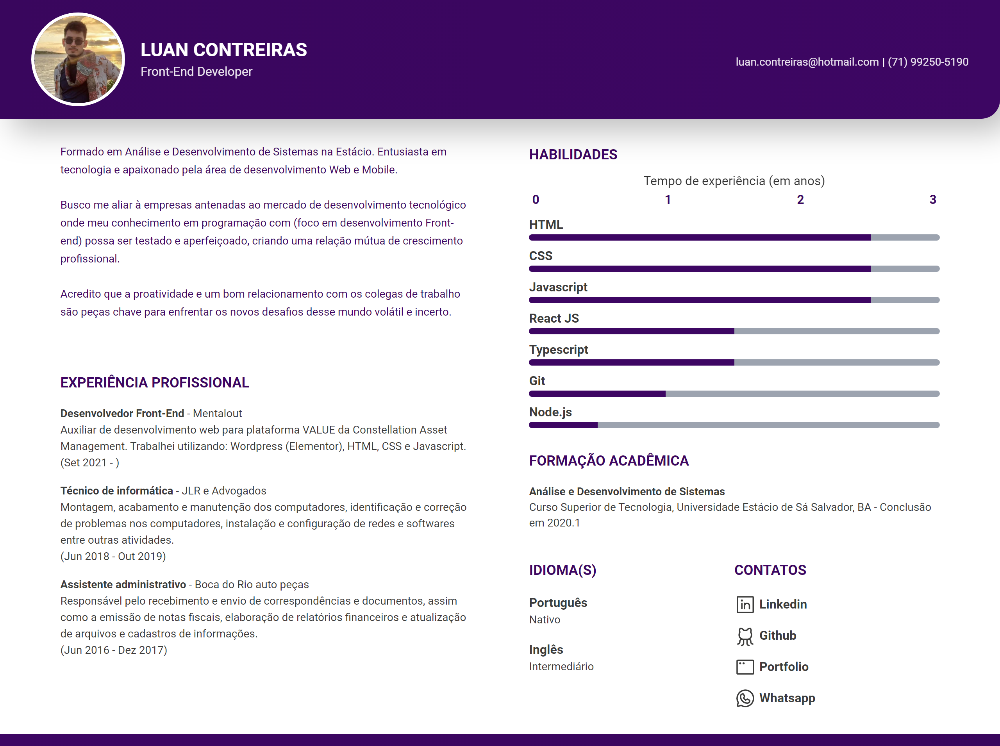
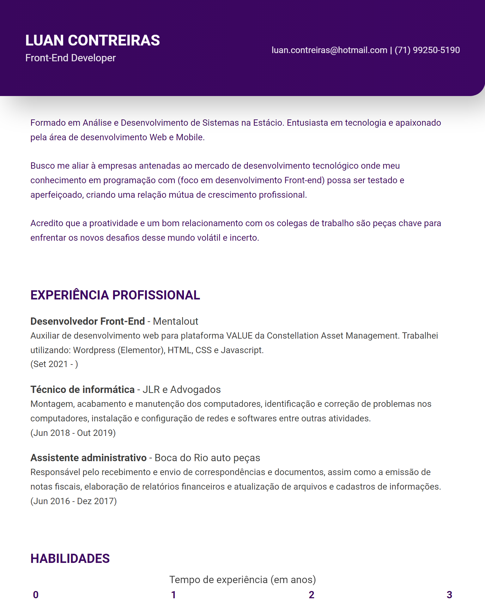

# Currículo - Luan Contreiras

Currículo construido utilizando React (Next JS) e utilizando a metodologia Mobile First.

## Desktop

## Tablet

  

## Mobile

  

  

## 👨‍💻 Tecnologia

- React
- Typescript
- Tailwind CSS
- Next JS
- Git e Github

## 💻Aplicação

Para iniciar/testar a aplicação:

Rodar o seguinte command code na pasta ou em sua IDE

> npm run dev

Ou acessar o link do Vercel disponibilizado no "About" deste repositório.
